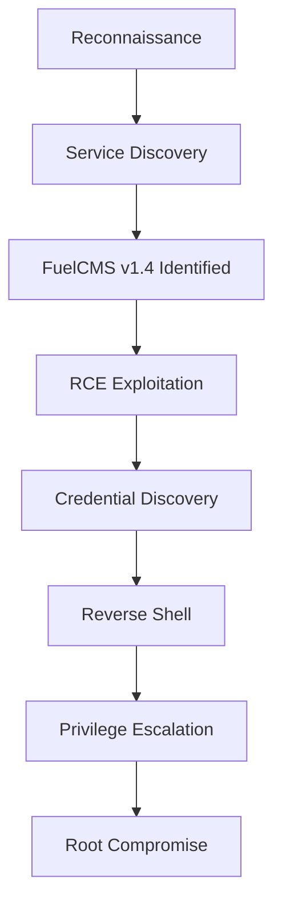

🔥 TryHackMe - Ignite CTF Writeup

https://img.shields.io/badge/TryHackMe-Ignite-red  https://img.shields.io/badge/Difficulty-Easy-green https://img.shields.io/badge/Category-CTF-blue

Solved By: Prince 👑
Date: 2025-09-30
Platform: TryHackMe

---

📋 Executive Summary

This comprehensive writeup documents the complete penetration testing methodology used to compromise the Ignite CTF machine. The target was vulnerable due to an outdated FuelCMS v1.4 installation with publicly available Remote Code Execution (RCE) exploits. The engagement demonstrates a classic web application to root compromise chain.

---

🎯 Attack Flow Overview



---

🔍 Phase 1: Reconnaissance

Network Scanning

Initial reconnaissance began with a comprehensive Nmap scan:

```bash
sudo nmap -vv -sS -sV -sC -oN nmap_out 10.10.62.131
```

📊 Scan Results:

· Port 80/tcp: HTTP service running Apache httpd 2.4.18 (Ubuntu)
· Service: FuelCMS v1.4

---

🌐 Phase 2: Web Application Assessment

Initial Discovery

· Accessed the target IP in web browser
· Identified FuelCMS v1.4 as the content management system
· Discovered default administrative credentials on the landing page

Admin Panel Access

· Successfully logged into /fuel admin dashboard
· Admin panel functionality was limited but access was confirmed

---

💥 Phase 3: Vulnerability Analysis & Exploitation

Vulnerability Research

· FuelCMS v1.4 has multiple published RCE vulnerabilities
· Three distinct RCE exploits identified via Exploit-DB

Initial Foothold

Leveraged RCE vulnerability to execute system commands:

```bash
cat fuel/application/config/database.php
```

🔑 Credentials Discovered:

· Username: root
· Password: Retrieved from database configuration file

---

🐚 Phase 4: Establishing Foothold

Reverse Shell Deployment

Step 1: Payload Preparation

· Used PentestMonkey's PHP reverse shell
· Modified with appropriate callback IP and port

Step 2: Payload Delivery

```bash
# Started HTTP server for payload delivery
python3 -m http.server 80
```

Step 3: Listener Setup

```bash
# Established netcat listener
rlwrap nc -lvnp 4444
```

Step 4: Shell Activation

· Triggered shell download and execution via RCE vulnerability
· Successfully caught reverse shell connection

---

⬆️ Phase 5: Privilege Escalation

Shell Stabilization

Upgraded to fully interactive TTY shell:

```bash
python -c 'import pty; pty.spawn("/bin/bash")'
```

Root Access

Used discovered credentials for privilege escalation:

```bash
su root
# Entered password retrieved from database configuration
```

---

🏴 Phase 6: Flag Capture

User Flag

· Located and submitted user flag via RCE command interface

Root Flag

· Successfully accessed root directory
· Captured and submitted root flag

---

🛡️ Security Findings & Recommendations

Critical Vulnerabilities Identified:

1. Outdated Software Components
   · FuelCMS v1.4 contains known RCE vulnerabilities
   · Recommendation: Upgrade to latest patched version
2. Default Credentials Exposure
   · Default credentials displayed on public-facing page
   · Recommendation: Remove default credentials and enforce strong password policies
3. Insufficient Access Controls
   · RCE vulnerability allowed complete system compromise
   · Recommendation: Implement proper input validation and sanitization

Lessons Learned:

· Python's HTTP server module is effective for payload delivery
· Outdated web applications pose significant security risks
· Proper shell stabilization is crucial for effective post-exploitation

---

📚 References

· FuelCMS Official Site
· Exploit-DB FuelCMS Vulnerabilities
· PentestMonkey Reverse Shell Cheat Sheet

---

🎖️ Conclusion

The Ignite CTF machine demonstrated a classic web application penetration testing scenario where outdated software components led to complete system compromise. The engagement highlighted the importance of regular software updates, proper credential management, and robust input validation in web applications.
